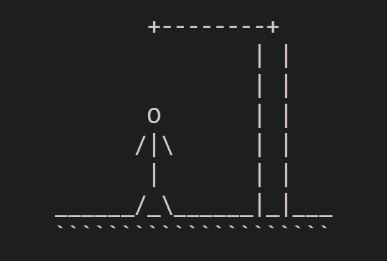
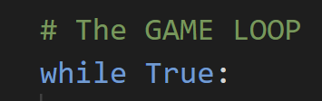

# **Hangman**
#

## Overview

### **About Hangman**
Hangman is a guessing game in which the objective of the player is to find out the hidden word. Every incorrect guess leads to the decrement of the chances left for the player.

The chances left are represented in the form of a hanging man. And the job of every hero is to save lives.

### **Designing Hangman**
Before we move on to the section of creating the game logic, we first need to figure out how the game will look for any player. There are two particular design components in this game:

🠖 The Hangman – We need to provide a visual aid to the player in the context of the hanging man.
🠖 Word Display – At the start of the game, the word must be displayed as blanks, instead of letters.

### **Hangman Design**
As we know, after every incorrect move, a new part of the hanging man’s body is displayed. To implement this, we store the body parts in a list.

The function that handles these hangman values is presented below:

The image below displays all the hangman states possible in the game. Each incorrect mistake adds a body part until the body is complete and the player loses.

The state displayed in the image below represents the hangman escaping the gallows after the player guesses the complete word.

The function below, 'print_hangman_win()' takes care of printing the escaped hangman when the player wins.

### **Word display**
The 'clear()' function is responsible for clearing the terminal. It makes use of inbuilt 'os' library of Python.

At the start of the game, only the blanks must be visible. After each player input, we must manipulate what needs to be displayed.

Initially, the list 'word_display' contains underscores for every alphabet in the hidden word. The following function is used to display this list.

### **Data-set for words**
In this part of creating the game, we can let our imagination run wild. There can be multiple ways to access the list words like importing from a .csv file, extracting from a database, etc.
To keep this project simple, I have hard-coded some categories and words.

Let us understand the data-structures used here:
🠖 'topics'– This Python dictionary provides, each category with a numeric value. This will further be used to implement a category-based menu.
🠖 'dataset' – This Python dictionary contains a list of words in each category. After the player chooses a category, we are supposed to pick words from here itself.

### **Game Loop**
Every game which depends upon a series of moves from the player requires a game loop. This loop is responsible for managing the player input, displaying game design, and other essential parts of game-logic.

Inside this game loop, we will take care of the following things:

#### **Game Menu**
The game menu is responsible for providing the notion of game-control to the player. The player decides the category on the basis of his/her interests.

It is advisable to always provide an option of quitting the game, whenever a game menu is created.

#### **Handling the player’s category choice**
A game developer no matter what level of skill, must always handle player input with great attention. The game must not crash on some erroneous player input.

After doing some sanity checks, we are ready to pick the word for the game-play.

### **Pick the game-play word**
We use the inbuilt Python library, 'random' for picking a random word from the specific category list.

After picking the word, comes the game-logic section.

### **Game-Logic for Hangman**
The function 'hangman()' contains the entire game functioning. It includes storing incorrect guesses, reducing the number of chances left, and printing the specific state of hangman.

The above code snippet contains all the elementary data structures and variables required for smooth functioning of our hangman game.

### **Initialize necessary components**
One of the most important aspects of creating a game is the initial state of the game components.

We are required to initialize the structure of word display as it will vary for every other word for the game. For our convenience, we initialize the container for storing the correct letters, in the same loop.

Note: This version of the hangman game only supports the guessing of the alphabets. If the reader wants to add the functionality of guessing other elements like numbers or special characters, the changes have to be made here.

### **Inner game loop**
This inner game loop is responsible for controlling the flow of single gameplay of the hangman game. It includes showing proper display, handling character input, updating the necessary data structures, and other key aspects of the game.

### **Player’s move input**
This part of our game deals with the player’s interaction with our game. The input must be checking for few scenarios before implementing it in the game logic:

🠖 Valid length – Since we are accepting a single character, we need to check in case the player mischievously enters multiple characters. 
🠖 An alphabet? – As told before, our version of the hangman game only supports guessing of alphabets. 
🠖 Already tried – Being a considerate programmer, we have to notify if the player enters an incorrect and already tried alphabet.

### **Manage the player’s move**
It is quite obvious that we will come across only two situations while managing the player’s move.

🠖 Incorrect Alphabet: For an incorrect move, we update the list of incorrect letters and the hangman display (adding body-parts).

🠖 Correct Alphabet: In case, a capable player enters a correct alphabet, we update our word display.

## **User Stories**

- As a User, I want to be able to run the program.
- As a User, I want to be able to view the game menu.
- As a User, I want to be able to select a category.
- As a User, I want to be able to exit the game.
- As a User, I want to be able to guess a letter.
- As a User, I want to be able to know if I have already guessed a letter.
- As a User, I want to be able to see the all the states of the visual hanging man.
- As a User, I want to be able to see the word displayed as blanks at the start of the game.
- As a User, I want to be able to see the letters in the word as correct guesses are made.
- As a User, I want to be able to see the list of incorrect characters that have been guessed.
- As a User, I want to be able to know if I have won the game.
- As a User, I want to be able to know if I have lost the game.

## **Technologies Used**

### **Languages**
This is a command-line application built purely using `python` as the main programming language.

### **Tools**
- [Github](https://github.com/) for store and version control of the code
- [Gitpod](https://gitpod.io/workspaces) for editing code
- [Heroku](https://heroku.com/) for deployment
- [Amiresponsive.com](https://ui.dev/amiresponsive) for generating the mock-up

## **Future Features**

* At the moment, the game is a single-player experience, and no scores are recorded. It could be possible to store the scores in a document, that could then be accessed by different players.
* Larger selection of words to be stored ina Google sheet and be integrated via API.
* Scoreboard for the user to view how many games they have won and lost.
* Some modifications to gameplay (house rules) to increase the difficulty level could be implemented, such as limiting guesses on high-frequency consonants and vowels.

## **Testing**

### **Test Cases**
- The program runs successfully, the user is presented with the game menu and is able to select among the options available:

- All the states of the visual hanging man display successfully, as well as the word only made of underscores at the start of the game:

- The letters successfully appear in the word as correct guesses are made:

- Feature that lets the user know if they have won the game works as expected:

- The program successfully tells the user if a guess has already been made:

- Feature that lets the user know if they have lost the game work as expected:

### **Validation**
I have tried to test my code with https://pep8online.com/, but their domain has expired. 
As a workaround, I have added a PEP8 validator to my Gitpod Workspace directly by following these steps:
- Run the command pip3 install pycodestyle. Note that this extension may already be installed, in which case this command will do nothing.
- In your workspace, press Ctrl+Shift+P (or Cmd+Shift+P on Mac).
- Type the word linter into the search bar that appears, and click on Python: Select Linter from the filtered results.
- Select pycodestyle from the list.
- PEP8 errors will now be underlined in red, as well as being listed in the PROBLEMS tab beside your terminal.

## **Bugs**

The image below shows the existing bugs in the program in its current state, and the lines they refer to.
These errors have been deliberately ignored as they don't affect code functionality.

## **Deployment**

This application has been deployed to Heroku. The deployment process is described below:
- Login on the [Heroku](https://id.heroku.com/login) website, [create](https://signup.heroku.com/login) your free account if you don’t have one already.
- On your dashboard, click on the **New** button on the top right-hand corner, and then click on **Create new app**.
- Next, type in your project name, which has to be unique, then choose your region and click on **Create App**.
- You will come to the next screen, and we will set the **Settings** first and then **Deploy**.
- In the **Settings**, scroll down until you reach **Config Vars**, and click on the button **Reveal Config Vars**.
- In the **KEY** section type **PORT** (it MUST be in capital letters) and in the **VALUE** section **8000**.
- Then you will scroll down and add two buildpacks in the **Settings**, first **Python** and second **Node.js**. Be aware of the order of these two, it has to be exactly like this (Python first and Node.js second), otherwise it will cause problems when we deploy the project.
- That's all the settings we need to do. Now let's go to the **Deploy** tab. In the deployment method, I connected my Github account, for this project. You must type in the name of your repository in order for it to be connected.
- At the bottom of the page, choose **Manual deploy**, and then click on the **Deploy Branch** button.
- The deployment process will start and will take a few minutes.
- When the deployment has completed, it will display the message **"Your app was successfully deployed"** with a **View** button below the message, which will take you to your deployed site by clicking on it.

## **Local Deployment**

Instructions to run the program from the Terminal or Command Prompt:
- Open the repository in Gitpod by clicking on the 'Gitpod' green button on the top right-hand of the screen:
- To start, you need to make sure the command line application you are using has access to your Python installation. To do this, open the command prompt, type `python` and press ‘Enter’. You should see a message that documents the Python version that is being used followed by `>>>`, which indicates the next code you type will be executed by the Python interpreter.
- All you need to do is type `python3` followed by the script name (`run.py`). The command-line to run the program will therefore be: 
`python3 run.py`

Note: To run a backend Python file, type `python3 app.py`, if your Python file is named `app.py`, of course.

If you would like to make a clone of this repository, you can type the following command in your IDE terminal: 
`git clone https://github.com/Yari-Carelli/Hangman-Game`
Alternatively, if using Gitpod, you can click below to create your own workspace using this repository.

## **Acknowledgments**

* Tutor Support from Code Institute, for helping me out when I got stuck.
* [Stackoverflow](https://stackoverflow.com/), for researching answers to all matter of questions, both large and small. 
* My mentor Rohit Sharma, for his immense patience, and for simply being a "python god".
* My family, who play-tested the application in its various iterations.

